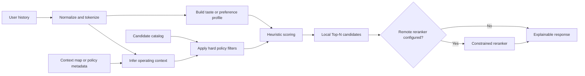
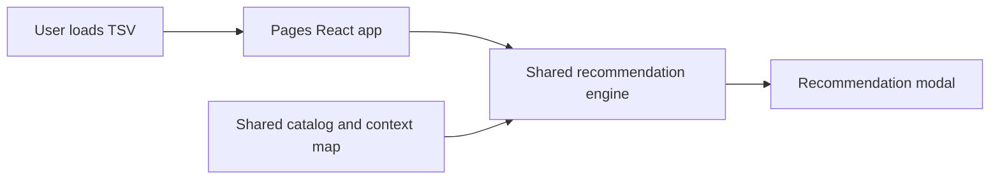
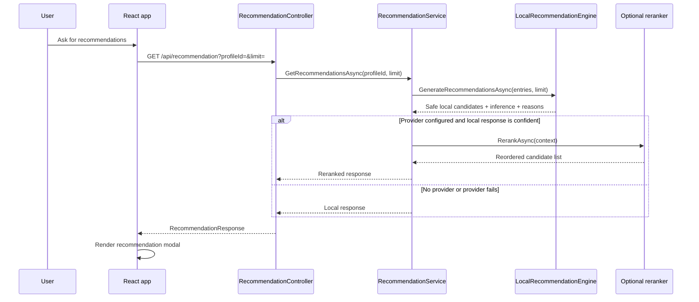
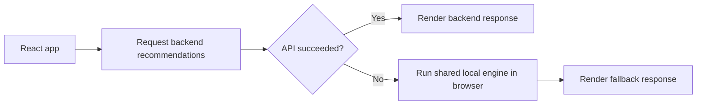
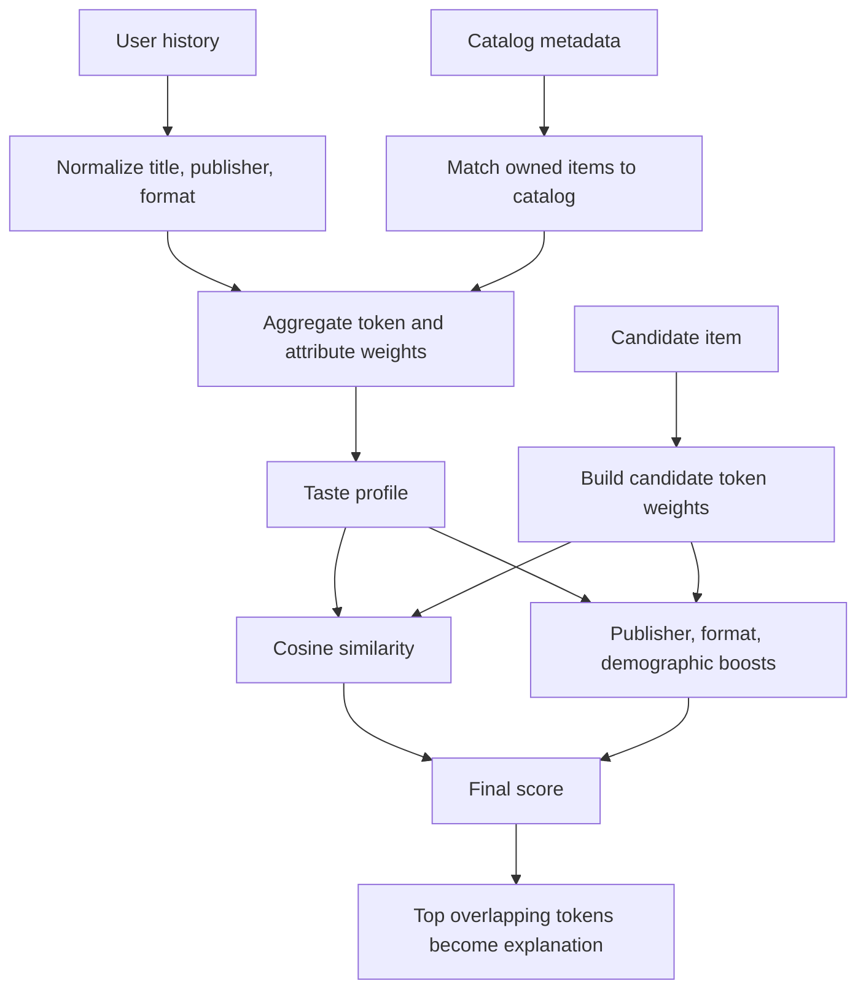

# Recommendation System Architecture

This document explains the recommendation system as a reusable architecture first, and only then maps that architecture to this repository.

The goal is to make the design teachable without requiring the reader to know MangaCount, its UI, or even the manga domain. The same structure can be reused for courses, products, movies, books, jobs, or any other recommendation problem where a system must combine user history, policy constraints, and ranking logic.

## 1. Problem Statement

At a generic level, this system solves the following problem:

1. Take a user's interaction history.
2. Infer an operating context from that history.
3. Enforce hard business or policy constraints.
4. Build a deterministic baseline ranking from local metadata.
5. Optionally rerank the safe candidate set with a remote model.
6. Return an explainable Top-N response.

In this repository, the inferred context is the user's market, derived from publisher-country ownership patterns. In another system, the inferred context could be language, region, device class, subscription tier, age band, or any other policy boundary.

## 2. Generic Vocabulary

| Generic term | Meaning | MangaCount implementation |
| --- | --- | --- |
| User history | Observed preferences or owned items | `EntryModel` list or TSV-loaded entries |
| Candidate catalog | Items that may be recommended | `catalog.json` |
| Context map | Metadata used to infer operating context | `publisher-countries.json` |
| Context inference | Rule that derives market or environment from history | `inferUserCountry` / `InferUserCountry` |
| Hard filter | Constraint that cannot be violated | No already-owned items, no cross-market items |
| Baseline ranker | Deterministic local recommendation engine | `recommendationEngine.js` / `LocalRecommendationEngine.cs` |
| Optional reranker | Remote model that reorders safe candidates | GitHub Models / OpenRouter providers |
| Explainable response | Ranked output with reasons and metadata | `RecommendationResponse` |

## 3. Architectural Summary

The system is intentionally split into two layers:

1. A local deterministic core that always enforces the hard rules and can run without any remote dependency.
2. An optional reranking layer that can improve ordering, but is not allowed to expand the safe candidate set.

That split is the core teaching idea. It gives the system four important properties:

1. Safety: hard filters are applied before any optional model sees candidates.
2. Availability: the system still works when the network or provider fails.
3. Explainability: local scores and reason strings can always be produced.
4. Portability: the same core logic can power an offline demo and a production app.

## 4. Generic Pipeline Diagram



## 5. System Variants In This Repository

### 5.1 Local-only variant: GitHub Pages demo

The Pages app uses only the shared JavaScript engine and shared metadata. It does not call the backend for recommendations.



Implementation mapping:

- Entry point: `Pages/src/App.jsx`
- Shared engine import: `recommendManga` from `shared/recommendations/recommendationEngine.js`
- Shared data imports: `catalog.json` and `publisher-countries.json`
- Presenter: `Pages/src/components/RecommendationModal.jsx`
- Shared alias wiring: `Pages/vite.config.js`

### 5.2 Hybrid variant: production app

The real app asks the backend for recommendations first. If the API fails, the frontend falls back to the same shared JavaScript engine used by Pages.



Frontend fallback path:



Implementation mapping:

- Frontend orchestration: `mangacount.client/src/App.jsx`
- API controller: `MangaCount.Server/Controllers/RecommendationController.cs`
- Service orchestration: `MangaCount.Server/Services/RecommendationService.cs`
- Local backend engine: `MangaCount.Server/Services/LocalRecommendationEngine.cs`
- Provider contract: `MangaCount.Server/Services/Contracts/IRecommendationRankingProvider.cs`
- Provider implementations:
  - `MangaCount.Server/Services/GitHubModelsRankingProvider.cs`
  - `MangaCount.Server/Services/OpenRouterRankingProvider.cs`

## 6. Algorithm Stages

### 6.1 Normalization

Normalization is its own stage because recommendation quality depends on comparing like with like.

Current normalization rules:

1. Convert to lowercase.
2. Remove diacritics.
3. Remove parenthetical text.
4. Remove edition noise such as `kanzenban`, `deluxe`, `perfect edition`, `volume`, `part`, and similar terms.
5. Remove punctuation.
6. Collapse whitespace.
7. Tokenize the cleaned text.

Why this matters generically:

- It reduces duplicate identities for the same item.
- It makes catalog-to-history matching more stable.
- It prevents edition or formatting noise from dominating similarity.

Implementation:

- Shared JavaScript: `shared/recommendations/normalize.js`
- Backend C#: `LocalRecommendationEngine` uses equivalent regex-based normalization logic.

### 6.2 Context inference

Before ranking, the engine infers the operating context from the user's history.

Current rule set:

1. Normalize the publisher of each owned item.
2. Map the publisher through the publisher-to-country dictionary.
3. Sum owned volumes per country.
4. Use series count as a tiebreaker.
5. If the top two countries tie on both volumes and series count, mark the inference as not confident.

Generic interpretation:

This is a context inference stage. In another system, the same pattern could infer language preference, platform ecosystem, subscription tier, or preferred content region.

Implementation:

- Shared JavaScript: `shared/recommendations/countryInference.js`
- Backend C#: `InferUserCountry` inside `MangaCount.Server/Services/LocalRecommendationEngine.cs`

### 6.3 Taste profile construction

The system converts the user's history into a weighted profile.

Signals used in the current implementation:

1. Owned title tokens.
2. Local publisher tokens.
3. Format tokens.
4. Catalog-derived genres.
5. Catalog-derived themes.
6. Catalog-derived demographic.
7. Catalog-derived summary text.
8. Quantity-owned weighting.

The profile contains:

- Token weights for free-text similarity.
- Publisher weights for same-publisher affinity.
- Format weights for edition preference.
- Demographic weights for audience-level preference.
- A set of already-owned normalized titles.

Generic interpretation:

This is a hybrid user representation that mixes structured features with text-derived features.

### 6.4 Hard filtering

Hard filters happen before ranking.

Current hard rules:

1. Never recommend an item the user already owns.
2. Never recommend an item whose market does not match the inferred market.
3. If market inference is not confident, return a low-confidence response instead of guessing.

Generic interpretation:

These are policy or business rules, not preferences. They are binary gates.

This is the most important teaching distinction:

- Hard rules decide whether an item is allowed.
- Scoring decides how allowed items are ordered.

### 6.5 Local heuristic scoring

For each safe candidate, the local ranker computes:

1. Token overlap using cosine similarity between the user profile and the candidate token vector.
2. Publisher affinity boost.
3. Format affinity boost.
4. Demographic affinity boost.

Current candidate feature weights:

- Title: 2.5
- Publisher: 1.1
- Format: 1.2
- Demographic: 1.8
- Genres: 2.4
- Themes: 2.1
- Summary: 1.0

Current user-profile contribution weights are quantity-sensitive and slightly different because they describe observed ownership rather than candidate metadata.

Generic scoring formula:

$$
\text{final score} = \text{cosine similarity} + \text{structured boosts}
$$

Where the structured boosts are small additive terms tied to recurring attributes in the user history.

### 6.6 Explainability

The engine does not only output a score. It also extracts the top overlapping tokens and turns them into a human-readable reason string.

Current explanation format:

- `Matches your collection through Drama, Action, Horror`

Generic interpretation:

This is a lightweight explanation layer that improves trust without exposing the entire scoring model.

### 6.7 Optional reranking

The backend can optionally rerank the already-safe local candidate set.

Important design rule:

The reranker does not generate new candidates. It only reorders candidates produced by the deterministic local engine.

In the current backend:

1. The local engine runs first.
2. If the result is low confidence or empty, the local response is returned immediately.
3. Otherwise, the service iterates through registered reranking providers in order.
4. The first configured provider that returns a valid ordering wins.
5. If a provider fails, the service logs a warning and falls back.

Provider order in this repository is defined by dependency injection registration order:

1. `github-models`
2. `openrouter`
3. Local response if none succeeds

The current prompt contract sent to a remote provider is deliberately narrow:

1. It sends an inferred country.
2. It sends the candidate list with ids and metadata.
3. It asks for `orderedIds` only.
4. It explicitly forbids inventing new ids.

That makes the remote model a constrained reranker, not an unconstrained generator.

## 7. Scoring Internals Diagram



## 8. Response Contract

The backend and local JavaScript engines both return the same logical shape.

```json
{
  "provider": "local",
  "inferredCountry": "Argentina",
  "isConfident": true,
  "availableCount": 3,
  "blockedByImportCount": 8,
  "limit": 3,
  "items": [
    {
      "id": "tokyo-ghoul",
      "title": "Tokyo Ghoul",
      "publisher": "Ivrea",
      "publisherCountry": "Argentina",
      "format": "Tankoubon",
      "demographic": "Seinen",
      "volumes": 14,
      "score": 6.714,
      "reason": "Matches your collection through Drama, Action, Horror"
    }
  ],
  "inference": {
    "country": "Argentina",
    "isConfident": true,
    "breakdown": []
  }
}
```

Generic interpretation of the fields:

- `provider`: which engine produced the final ordering.
- `inferredCountry`: inferred operating context.
- `isConfident`: whether the context inference is reliable enough to enforce context-based filtering.
- `availableCount`: number of returned items.
- `blockedByImportCount`: number of candidates removed by hard policy filtering.
- `limit`: requested maximum response size.
- `items`: final ranked candidates.
- `inference`: observability payload that explains context derivation.

Implementation model types:

- `MangaCount.Server/Model/RecommendationModels.cs`

## 9. Configuration Surface

The local engine requires only packaged metadata files:

- `shared/recommendations/catalog.json`
- `shared/recommendations/publisher-countries.json`

The backend rerankers are optional. They are activated only when configuration is present.

Supported environment variables:

- `MANGACOUNT_GITHUB_MODELS_ENDPOINT`
- `MANGACOUNT_GITHUB_MODELS_API_KEY`
- `MANGACOUNT_GITHUB_MODELS_MODEL`
- `MANGACOUNT_OPENROUTER_API_KEY`
- `MANGACOUNT_OPENROUTER_MODEL`
- `MANGACOUNT_OPENROUTER_ENDPOINT`

Generic design lesson:

Keep provider secrets out of frontend bundles and out of tracked public config. The local engine should remain usable even when remote providers are disabled.

## 10. Why The Design Is Reusable

This implementation is specific in content but generic in shape.

You can reuse the same architecture anywhere you have:

1. A user history stream.
2. A metadata-rich item catalog.
3. A context or policy map.
4. Hard constraints that matter more than ranking quality.
5. A need for explainability.
6. A desire to keep a deterministic local baseline while allowing optional AI reranking.

Examples of analogous context inference stages in other systems:

- Courses: infer skill level or language.
- Shopping: infer price tier or shipping region.
- Streaming: infer content region or family-friendly mode.
- Jobs: infer seniority band or geography.
- News: infer language or regulatory market.

## 11. Repository Mapping Table

| Architectural concern | Primary files |
| --- | --- |
| Shared metadata contract | `shared/recommendations/README.md`, `catalog.json`, `publisher-countries.json` |
| Shared normalization | `shared/recommendations/normalize.js` |
| Shared context inference | `shared/recommendations/countryInference.js` |
| Shared local engine | `shared/recommendations/recommendationEngine.js` |
| Pages orchestration | `Pages/src/App.jsx` |
| Pages presentation | `Pages/src/components/RecommendationModal.jsx` |
| Real frontend orchestration and fallback | `mangacount.client/src/App.jsx` |
| Real frontend presentation | `mangacount.client/src/components/RecommendationModal.jsx` |
| API surface | `MangaCount.Server/Controllers/RecommendationController.cs` |
| Backend orchestration | `MangaCount.Server/Services/RecommendationService.cs` |
| Backend deterministic engine | `MangaCount.Server/Services/LocalRecommendationEngine.cs` |
| Provider chain wiring | `MangaCount.Server/Configs/CustomExtensions.cs` |
| Provider contract | `MangaCount.Server/Services/Contracts/IRecommendationRankingProvider.cs` |
| Remote reranker base | `MangaCount.Server/Services/OpenAiCompatibleRankingProviderBase.cs` |
| Provider implementations | `GitHubModelsRankingProvider.cs`, `OpenRouterRankingProvider.cs` |

## 12. Teaching Notes

If you need to teach this system to people who never use the app, present it in this order:

1. Teach the difference between hard filters and soft ranking.
2. Teach context inference as a separate phase before recommendation.
3. Teach the deterministic local baseline first.
4. Teach reranking as optional and constrained.
5. Show that the Pages app is the pure baseline architecture.
6. Show that the real app is the production architecture with orchestration and fallback.

The simplest teaching sentence is:

> This is a hybrid recommendation architecture with a deterministic local core, context-aware policy filtering, and an optional constrained reranking layer.

That sentence is accurate for this repository and generic enough to reuse elsewhere.